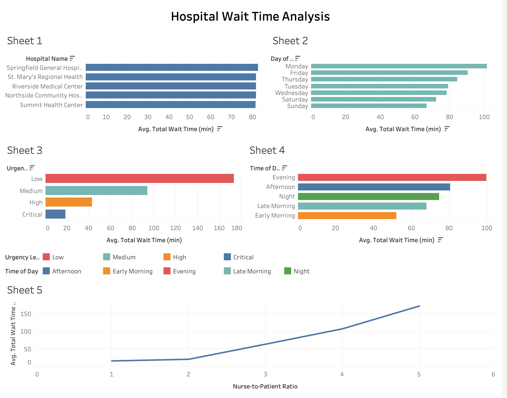

# Hospital Wait Time Analysis

## Project Overview
This project analyzes hospital emergency department wait times to identify operational factors affecting patient service efficiency.

## Tools Used
- SQL
- Tableau Public
- Data Visualization

## Key Business Questions
1. Which hospitals have the longest wait times?
2. Which days of the week experience the highest patient demand?
3. How does nurse-to-patient ratio affect wait times?
4. Does urgency level influence patient wait time?
5. What time of day has the highest hospital demand?

## Key Insights

### Hospital Performance
Springfield General Hospital had the highest average wait time (82.7 minutes).

### Weekly Demand
Monday showed the highest wait time (101.58 minutes).

### Staffing Impact
Higher nurse-to-patient ratios significantly increased wait times.

### Triage Effectiveness
Critical patients were treated fastest while low urgency patients waited the longest.

### Peak Operating Hours
Evening visits had the highest wait times while early morning had the lowest.

## Dashboard

## Project Files
- hospital_wait_time.csv
- hospital_analysis.sql
- hospital_dashboard.png
